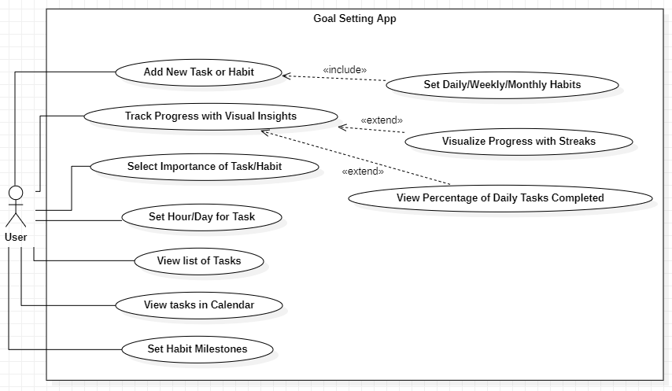
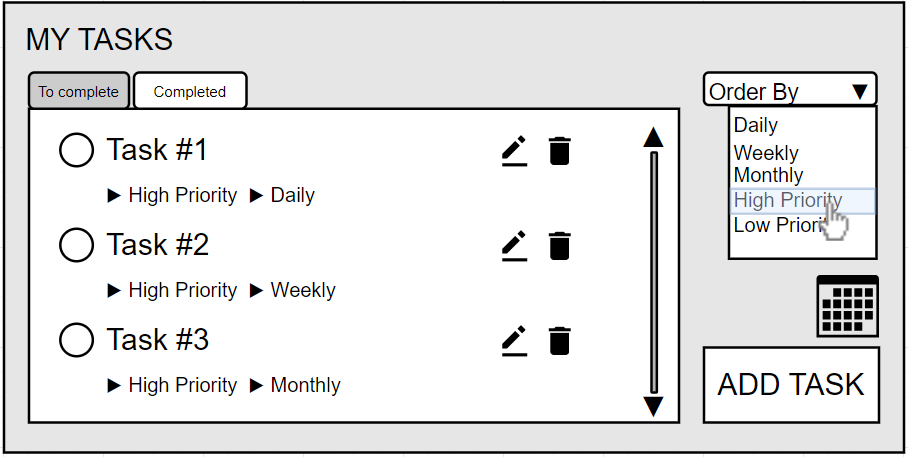
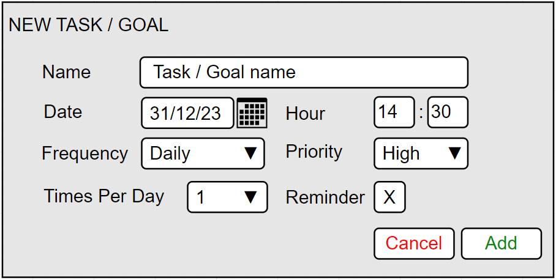
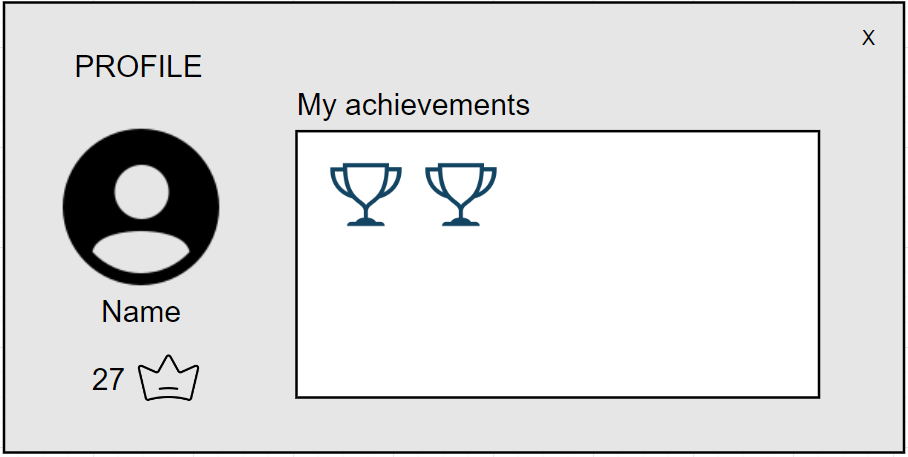
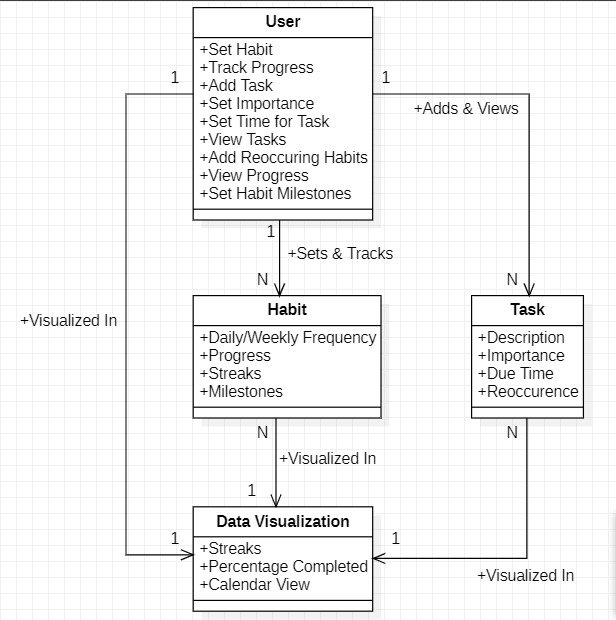
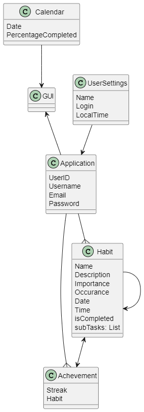

# GoalTracker

## Contents

- [Team](#team)
- [Vision and Scope](#vision-and-scope)
- [Requirements](#requirements)
    - [Use case diagram](#use-case-diagram)
    - [Mockups](#mockups)
    - [User stories](#user-stories)
- [Definition of Done](#definition-of-done)
- [Architecture and Design](#architecture-and-design)
    - [Domain Model](#domain-model)
- [Risk Plan](#risk-plan)
- [Pre-Game](#pre-game)
- [Release Plan](#release-plan)
  - [Release 1](#release-1)
  - [Release 2](#release-2)
- [Increments](#increments)
  - [Sprint 1](#sprint-1)
  - [Sprint 2](#sprint-2)
  - [Sprint 3](#sprint-3)

## Team

- Eliza Czaplicka - 2022110771 - a2022110771@isec.pt
- João Carvalho - 2019131769 - a2019131769@isec.pt 
- Pedro Paiva  -  2021134625 - a2021134625@isec.pt
- Tomás Ferreira - 2021130424 - a2021130424@isec.pt
- Gabriel Losada - 2023109148 - a2023109148@isec.pt
 
***

## Vision and Scope

#### Problem Statement

##### Project background

Many people struggle with sticking to their goals. They often set goals that are too ambitious and then get discouraged when they don't achieve them. This can lead to feelings of failure and low self-esteem. 

##### Stakeholders

<!--This is a bulleted list of the stakeholders. Each stakeholder may be referred to by name, title, or role ("support group
manager," "CTO," "senior manager"). The needs of each stakeholder are described in a few sentences.-->
- University
- High schools
- Individual users

##### Users

- Students
- Young adults
<!--- User wants to save a certain amount of money in a month
    - Tracking of how much more can they spend to reach their goal
- User wanting to track their habits
    - Wants a simple way to see how much they are sticking to their habits
- User wants to remember when to water their plants
    - Wants an option to add tasks for every few days -->

***

#### Vision & Scope of the Solution

##### Vision statement

<!--The app is designed to be minimalistic and user-friendly, allowing easy task management and progress tracking. Users can set schedules, monitor completion percentages, and maintain streaks for consistent habits. The app rewards task and habit completions with badges.-->
<!-- The goal of this project is to create an app that will help them remember their resolutions, habits and budgeting goals. It will be an easy way of keeping track of your achievements providing a sense of acomplishement with every finished task. Visualizing your spending will also help with sticking to your saving goals and enable you to track your expenses. We want to help others and ourselves stick to our goals and live the best life we can. -->

The goal of this project is to create an app where users can define daily, weekly, and monthly goals or set tasks, whether they are for a specific time or not. Then, they can check which of these tasks/goals they have completed or still need to complete.

##### List of features

Habit/Goal Tracking:
- Users can set and monitor daily, weekly, or monthly habits.
- Progress tracking with visual insights and streaks.
- Add new task or habit button
- Importance of task/habit selection
- Option to set a certain hour or day for a task
- List of tasks to complete
- Option of adding reoccuring habits 
- Task reminders
- Habit milestones.

Data Visualization:
- Progress tracking with streaks.
- Visual idication of percantage completed each day of past month
- Calendar view
- Percantage of daily tasks completed

##### Features that will not be developed

- Separate graphs for each habit
- User forums and communities
- Social sharing of achievements and financial progress

##### Assumptions

Users will appreciate the value of habit tracking as a personal development tool.
Users are motivated to set clear and achievable goals related to habits and achievements.
Users aspire to change their habits and employ the app as a means to modify their behavior.
Users have varied habits requiring the availability of customization features.
User requirements and preferences can change over time.

***

## Requirements

### Use Case Diagram

***

### Mockups

### User Storie 1

### User Stories 2 - 6

### User Storie 9

***

### User Stories

- User story 1 (#1)
- User story 2 (#2)
- User story 3 (#3)
- User story 4 (#4)
- User story 5 (#5)
- User story 6 (#6)
- User story 7 (#32)
- User story 8 (#33)
- User story 9 (#34)
***

## Definition of done

(This section is already written, do not edit)
It is a collection of criteria that must be completed for a User Story to be considered “done.”

1. All tasks done:
  - CI – built, tested (Junit), reviewed (SonarCloud)
  - Merge request to qa (code review)
2. Acceptance tests passed
3. Accepted by the client
4. Code merged to main

***

<!-- ##### User Story 1

As a student, I want to set deadlines for my assignments so that I can manage my time efficiently.

##### User Story 2
As a user, I want to earn badges for completing tasks so that I can feel a sense of accomplishment.

##### User Story 3
As a fitness enthusiast, I want to track my exercise routines so that I can maintain a consistent workout schedule.

##### User Story 4
As a learner, I want to monitor my study hours so that I can ensure I'm preparing adequately for exams.

##### User Story 5  
As a gardener, I want to set reminders for watering and pruning plants so that I can maintain a healthy garden.

##### User Story 6
As a blogger, I want to set a habit of writing a post every week so that I can engage my audience regularly.

 -->

## Architecture and Design

#### Domain Model

<!---->

***

## Risk Plan

##### Threshhold of Success
<!---
The project fails if:
 Essential features such as habit tracking, visual progress insights, task and habit management, reminders, and goal setting are incomplete or not functioning as intended.
Users find it difficult to navigate the app or encounter usability issues, leading to dissatisfaction and disengagement.
Reminders are unreliable, causing users to miss their tasks and habits frequently.
Milestone tracking for goals is confusing or not visually represented clearly, leading to user frustration.

- The "must" user stories are not developed
- The app is not in a working condition upon release.
The team is not satisfied with the app and their work on the project, based on a questionare at the last meeting before final release. -->

The project is successful if:
<!--- By the final release date, all essential features, namely habit tracking, task and habit management and reminders, are fully implemented and pass acceptance tests without critical defects.
Users find the app intuitive, user-friendly, and engaging, leading to positive feedback and a high level of satisfaction.
Reminders are delivered accurately and on time, ensuring users can effectively manage their tasks and habits.
Milestone tracking for goals is visually appealing, easy to understand, and provides users with a sense of achievement and progress. -->

- All "must" user stories are developed and tasks assigned to them finished.
- All group members contibuted to the project equally (rounded up to the nearest hour).
- The team is satisfied with the app and their work on the project, based on a questionare at the last meeting before final release.
<!-- - The interface of the app it appealing to most group members and clients. -->

##### Risk List
<!-- - RSK1 - PxI: 4x5=20; Inaccurate Time and Effort Estimations
  - Risk: The team lacks experience in estimating the time and effort required for tasks, leading to underestimations or        overestimations, resulting in unforeseen project delays.
  - Impact: 5
  - Likelihood: 4 -->
- RSK1 – PxI: 4x4=16; Project Management Issues
  - Risk: Lack of experience may lead to difficulties in project management, such as inadequate task definition, incorrect resource allocation, and ineffective sprint planning.
  - Impact: 4
  - Likelihood: 4
- RSK2 – PxI: 3x4=12; Code Quality and Best Practices
  - Risk: The team may not be aware of coding best practices and quality standards, resulting in low-quality code and future maintenance challenges.
  - Impact: 3
  - Likelihood: 4
- RSK3 – PxI: 2x3=6; Deficient Integration and Testing
  - Risk: Lack of experience may lead to deficiencies in component integration and adequate testing, resulting in undetected failures and bugs before the release.
  - Impact: 2
  - Likelihood: 3

##### Mitigation Actions (threats>=20)
- R1 - Inexperienced Time and Effort Estimation:
  - Action: Conduct Estimation Sessions and Weekly Reviews
  
## Pre-Game
### Sprint 0 Plan

- Goal: description
- Dates: from 10-13/Oct to 24-27/Oct, 2 weeks
- Sprint 0 Backlog (don't edit this list):
  - Task1 – Write Team
  - Task2 – Write V&S
  - Task3 – Write Requirements
  - Task4 – Write DoD
  - Task5 – Write Architecture&Design
  - Task6 – Write Risk Plan
  - Task7 – Write Pre-Gane
  - Task8 – Write Release Plan
  - Task9 – Write Product Increments
  - Task10 – Create Product Board
  - Task11 – Create Sprint 0 Board
  - Task12 – Write US in PB, estimate (SML), prioritize (MoSCoW), sort
  - Task13 – Create repository with “GPS Git” Workflow

***

## Release Plan

### Release 1

- Goal: MVP - We define our MVP as an app that will offer this possibilities and functionalities to the user: <!-- MVP - Developed US1, US3, US4, US6 with a working interface. -->
  - Add new tasks
  - Edit tasks
  - Delete tasks
  - List tasks
- Dates: 30/Nov
- Team capacity: 4 * 5 * 5 =  100 hours
- Release: V1.0

***

### Release 2

- Goal: <!-- Final release – Developed US2 and US5. The interface is aestheaticaly pleasing and intuitive. -->
  - Streaks and prizes implemented
  - Calendar with goals/tasks
- Date: 15/Dec
- Team capacity: 4 * 5 * 2 = 40 hours
- Release: V2.0

***

## Increments

### Sprint 1
##### Sprint Plan

- Goal: <!-- Create the base architecture of the app and basic interface. -->
  - List tasks
  - Add new tasks with most of the inputs

- Dates: from 30/Oct to 10/Nov, 2 weeks

- Roles:
  - Product Owner: Eliza Czaplicka
  - Scrum Master: Pedro Paiva

- To do:
  - US1: As a user, I want to be able to see which tasks I need to complete or the ones I already completed.

  - US2: As a user i want to set a task to a specific day so i dont forget to do it.

  - US3: As a user i want to set an habit that i want to do every day/week/month so i dont forget to do it 
  
  - US6: As a user i want to set the priorities of the tasks i have to do so i can know which ones i need to do first
  
- Story Points: 2S+2M

- Analysis: short analysis of the planning meeting

##### Sprint Review

- Analysis: Nothing was done

- Story Points:

- Version: 0.1 

- Client analysis: 
  - Sprint 1 was not accepted by the client.
  - Much things were not done and need to be reviewed and redone.

- Conclusions:
  - Redo the Sprint1.
  - Create sporadic tasks, periodic tasks (daily, weekly, monthly, etc.), repeated multiple times, priorities, mark as done.

##### Sprint Retrospective

- What we did well:
    - Started the project.
    - The ideia was clear and understood.
    - Almost did all the tasks that were supposed to be done.
- What we did less well:
    - Dividing the work among the team members.
    - Not worked enough this sprint.
- How to improve to the next sprint:
    - Finish all the tasks in the sprint.
    - Better communication.
    - Work harder, individually and as a group. 

***

#### Sprint 2
##### Sprint Plan

<!--Tasks for sprint 2: more interface, sorting and filtering of tasks by labels and importance, calendar view of history
US4 - history of habits, their completion-->

- Goal: <!-- Create the base architecture of the app and basic interface. -->
  - List tasks
  - Create regular and esporadic tasks
  - Sort tasks by priority

- Dates: from 10/Nov to 24/Nov, 2 weeks

- Roles:
  - Product Owner: João Carvalho
  - Scrum Master: Tomás Ferreira

- To do:
  - US1: As a user, I want to be able to see which tasks I need to complete or the ones I already completed.
    - Task1: Create GUI to list all the tasks.
    - Task2: Check and set tasks as completed.
  - US2: As a user i want to set a task to a specific day so i dont forget to do it.
    - Task1: Add a single task.
  - US3: As a user i want to set an habit that i want to do every day/week/month so i dont forget to do it.
    - Task1: Add a task to do every day.
    - Task2: Add a task to do every week.
    - Task3: Add a task to do every month.
  - US4: As a user, I want to set a goal to achieve in a day/week/month so i can acomplish that goal.
    - Set a goal for a specific date.
  - US6: As a user i want to set the priorities of the tasks i have to do so i can know which ones i need to do first.
    - Task 1: Add tasks priority.
  <!-- - US7: As a user, I want to be able to set an habit a specific number of times in that day, so I remind myself to do that task every time. -->
    <!-- - Task1: Add a task to do multiple times a day.-->
    <!--- Task1: Add ability to add tasks.
    - Task2: Add task name input.
    - Task3: Add task date input and respective operations.
    - Task4: Add task hour input and respective operations.
    - Task5: Add task frequency input and respective operations. -->
    <!-- - Task6: Add task priority input and respective operations. -->
    
  
- Story Points: 2S+3M

##### Sprint Review

- Analysis: Much better than the last sprint.

- Story Points: 2S+3M

- Version: 0.1 

- Client analysis: 
  - Sprint 2 done. Almost everything done apart the JUnit tests. Some suggestions were provided regarding the GUI and how that tasks will be displayed.

- Conclusions: 
  - Change the GUI to only show todays's, tomorrow's, completed and no date tasks.

##### Sprint Retrospective

- What we did well:
    - Better comunication about work division among team members.
    - Worked harder than the last sprint.
- What we did less well:
    - Testing the application with JUnit tests, only AC tests were done.
- How to improve to the next sprint:
    - Do JUnit tests and properly test the app.

***

***

#### Sprint 3
##### Sprint Plan

<!--Tasks for sprint 2: more interface, sorting and filtering of tasks by labels and importance, calendar view of history
US4 - history of habits, their completion-->

- Goal: <!-- Create the base architecture of the app and basic interface. -->
  - Set multiple tasks a day
  - Implement a reminder
  - Implement streak
  - Edit tasks
  - Deleting tasks

- Dates: from 24/Nov to 15/Nov, 3 weeks

- Roles:
  - Product Owner: Gabriel Losada
  - Scrum Master: Eliza Czaplicka

- To do:
  - US5: As a user, I want to receive a reminder of what task i have to do so dont forget about it.
  - US7: As a user, I want to be able to set an habit a specific number of times in that day, so I remind myself to do that task every time.
    - Task1: Add a task to do multiple times a day.
  - US9: As a user i want to have streaks and achievements so i can feel acomplished
  
- Story Points: 3L

##### Sprint Review

- Analysis: what was not done or what was added (Link to US or Task from the PB)

- Story Points: 2S+1M+2X+2H

- Version: 0.1 

- Client analysis: client feedback

- Conclusions: what to add/review

##### Sprint Retrospective

- What we did well:
    - A
- What we did less well:
    - B
- How to improve to the next sprint:
    - C

***
